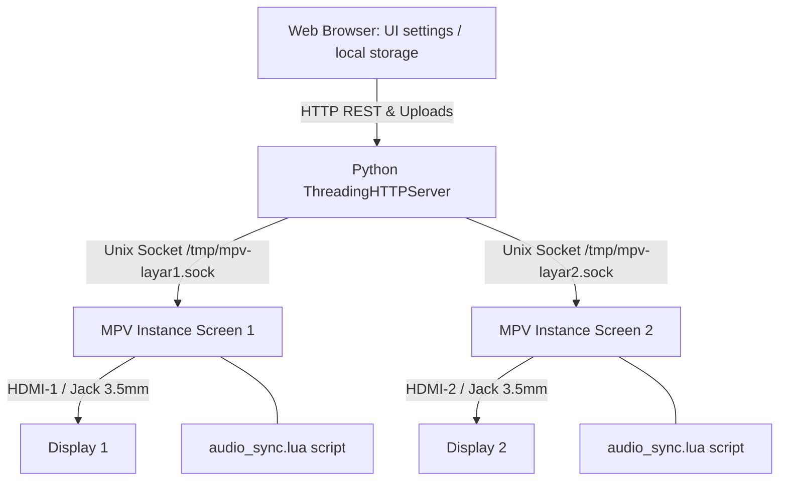

# caPiBarra CMS: Raspberry Pi Multi-Screen Video Signage Controller

`caPiBarra` (part of the **piEdge** project) is a web-based, lightweight, high-performance multimedia Content Management System (CMS) designed specifically to control and schedule independent dual-screen video playbacks on a **Raspberry Pi 4 Model B**. 

It integrates a multi-threaded Python backend with dual hardware-accelerated `mpv` player instances via JSON-IPC Unix domain sockets under Wayland (`labwc`), providing museum galleries, exhibitions, and digital signage spaces with seamless, lag-free, and robust video control.

---

## Key Features

- **Independent Dual-Screen Control**: Controls HDMI-1 (Layar 1) and HDMI-2 (Layar 2) outputs completely independently or concurrently.
- **Widescreen Wayland Acceleration**: Configured for hardware-accelerated playback (`v4l2m2m` and `dmabuf-wayland`) mapped onto precise screen coordinators under a `labwc` compositor.
- **Advanced Audio Routing Engine**:
  - **Output Routing**: Switch player audio outputs dynamically between HDMI ports or the shared 3.5mm Headphone Jack.
  - **Dynamic Channel Splitting**: Play video streams in Stereo, route Left channel audio only, or route Right channel audio only (e.g., to play separate audio tracks from Screen 1 on the Left jack channel and Screen 2 on the Right jack channel).
  - **Clip-Level Audio Settings**: Mute or enable sound for individual video clips inside playlists.
- **Media Library & Playlist Manager**:
  - Drag-and-drop web file uploader.
  - Interactive playlist reordering (move clips up/down, delete assets).
- **Diagnostics & Status Monitor**: Live metrics dashboard tracking CPU Temperature, CPU Usage, RAM Utilization, Disk Space, and system Uptime.
- **Multi-Device Cluster Manager**: Add, select, and switch between multiple Raspberry Pi players across different rooms from a single UI dashboard.
- **Premium User Experience**:
  - Responsive layout that adapts to desktops and mobile screens (sidebar collapses to a swipeable horizontal top navigation).
  - Bilingual localization support (Indonesian & English) dynamically applied.
  - Custom visual presets: **Modern Dark** (Obsidian Indigo) and **Retro Cyber** (Maroon/Crimson theme).

---

## Technical Stack & Architecture



### 1. Backend (`server.py`)
- Built using Python's standard `http.server.ThreadingHTTPServer` to avoid heavy external frameworks.
- Communicates directly with the `mpv` processes using JSON-IPC payloads over Unix domain sockets (`/tmp/mpv-layar1.sock` and `/tmp/mpv-layar2.sock`).
- Monitors hardware health parameters using `/sys/class/thermal` and `/proc` systems directly.

### 2. Frontend (`public/`)
- Single Page Application (SPA) built with vanilla HTML5, CSS3, and JavaScript.
- Employs dynamic `data-i18n` translation maps and CSS theme variables.

### 3. Audio Channel Splitting Mechanics
To route audio streams separately on the shared 3.5mm jack, FFmpeg `pan` audio filters are sent to the running players over IPC:
- **Left Channel Only (Right muted)**: `lavfi=[pan=stereo|c0=c0|c1=0*c1]`
- **Right Channel Only (Left muted)**: `lavfi=[pan=stereo|c0=0*c0|c1=c1]`
- **Stereo**: `""` (Empty string, clearing active audio filters)

---

## Directory Structure

```
piEdge/
├── public/                 # Web interface assets (frontend)
│   ├── index.html          # Main HTML Dashboard Layout
│   ├── app.css             # Glassmorphic and responsive styling
│   ├── app.js              # Localization dictionary & state controllers
│   ├── devices.json        # Predefined list of cluster Pi units
│   ├── logo.png            
│   └── placeholder.jpg     
├── audio_sync.lua          # MPV Lua script to keep audio routes synchronized
├── server.py               # Multi-threaded Python server & API backend
├── start_players.sh        # Script launching both MPV players under Wayland
├── rc.xml.addon            # Openbox/labwc window arrangement rules addon
└── *.service               # Systemd unit files (layar1, layar2, cms-signage)
```

---

## Installation & Setup

### 1. Prerequisites
Ensure your Raspberry Pi 4 is running Raspberry Pi OS (preferably Bookworm with Wayland/labwc) and the following packages are installed:
```bash
sudo apt update
sudo apt install python3 mpv labwc systemd-container
```

### 2. Setup Directories
Create the necessary folders for scripts and video files:
```bash
mkdir -p /home/pi/museum_signage
mkdir -p /home/pi/museum_video/layar1
mkdir -p /home/pi/museum_video/layar2
```

Copy the codebase contents into `/home/pi/museum_signage/`.

### 3. Configure systemd Services
Copy the service files from the repository to the systemd folder:
```bash
sudo cp /home/pi/museum_signage/*.service /etc/systemd/system/
sudo systemctl daemon-reload
```

Enable and start the services:
- **CMS Web App**:
  ```bash
  sudo systemctl enable cms-signage.service
  sudo systemctl start cms-signage.service
  ```
- **Screens Players (HDMI 1 & 2)**:
  ```bash
  sudo systemctl enable layar1.service layar2.service
  sudo systemctl start layar1.service layar2.service
  ```

---

## API Endpoints Reference

The Python backend exposes the following REST APIs:

- **`GET /api/status`**: Returns device health metrics, current player state, active playlist, and current audio routing configuration.
- **`GET /api/screenshot?screen={1|2}`**: Grabs a live screenshot frame from Screen 1 or Screen 2's mpv instance.
- **`POST /api/control`**: Sends playback commands (`play`, `pause`, `next`, `prev`, `stop_service`, `start_service`, `restart_service`) to a specific screen.
- **`POST /api/playlist/save`**: Saves a new ordered list of video files to `playlist.txt`.
- **`POST /api/audio/global`**: Dynamically adjusts global volume, audio output routing device (`hdmi` / `jack`), and channel modes (`stereo` / `left` / `right`).
- **`POST /api/audio/clip`**: Toggles mute settings for a specific video file.
- **`POST /api/upload?screen={1|2}`**: Receives file uploads and stores them directly in the respective screen's video directory.
- **`POST /api/delete`**: Deletes a media file from the disk.

---

## Development & Local Testing
For testing on Windows or macOS:
1. Run `python server.py`.
2. The server will detect that it is not running on a Raspberry Pi and run in **Mock Mode** (falling back to local directories and simulating MPV IPC responses).
3. Access the web interface at `http://localhost:8080`.

---

## Credits
- **Project Director**: Andri Risdianto
- **Lead Designer**: Yoga Sadewo
- **UI/UX**: Reza Pahlevi
- **Development Team**: Arief Hermanto, Arif Rofiudin, Farid Hidayat, Faiz Satrio, Wildan Ferdy.
- **Publisher**: Imajiwa Kreasi Visual / imajiwa.lab
